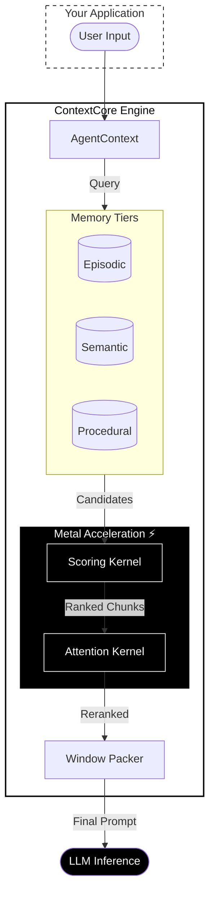
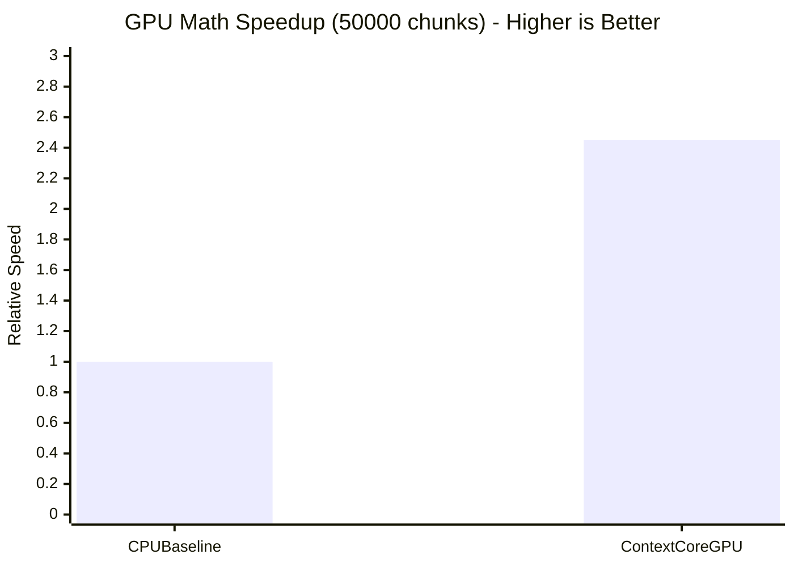

# ContextCore 🧠

<div align="center">
  
  <br>
  <h1><b>Aura ⚡️ ContextCore</b></h1>
  <h3><b>High-precision, low-latency memory scout for Apple Silicon.</b></h3>
  
  <p>
    <a href="https://swift.org"></a>
    <a href="https://developer.apple.com/ios/"></a>
    <a href="https://developer.apple.com/macos/"></a>
    <a href="LICENSE"></a>
  </p>
</div>

---

## ⚡️ The Strong Elements

*   **Metal-Accelerated Scoring:** Parallelized relevance & recency scoring using custom Metal shaders. Verified at **63.36M chunks/sec** and **2.45x GPU math speedup** on large workloads.
*   **Four-Tier Memory:** Working, Episodic, Semantic, and Procedural memory tiers.
*   **Progressive Compression:** Automatically applies light or heavy extractive compression to lower-signal chunks.
*   **Sub-5ms Window Builds:** `buildWindow(500, 4096)` now measures **4.89ms p99** on the latest full release run.
*   **Fast Background Consolidation:** `consolidate(2000)` now measures **15.61ms p99**.
*   **Attention-Aware Reranking:** Re-orders context chunks based on attention centrality.

## 🏗️ Architecture



## ⚖️ The ContextCore Advantage

| Feature | ❌ Standard LLM Usage | ✅ With ContextCore |
| :--- | :--- | :--- |
| **Recall** | Forgets early conversation turns as context fills. | **Perfect Recall**: Retrieves relevant turns from days ago using semantic search. |
| **Speed** | Slows down linearly as context grows. | **GPU-Tuned**: Window building stays under **5ms p99**, consolidation stays under **16ms p99**, and GPU math reaches **2.45x** CPU speedup at scale. |
| **Cost** | Wastes tokens re-sending irrelevant history. | **Cost Efficient**: Packs only high-value tokens; compresses the rest. |
| **Coherence** | Loses track of long-running tasks. | **Goal Oriented**: "Procedural Memory" tracks tool usage and task patterns. |

## 📊 Performance

ContextCore is designed to run locally on Apple Silicon.

```mermaid
xychart-beta
    title "Window Build Latency (p99) - Lower is Better"
    x-axis [Target Limit, ContextCore (M2)]
    y-axis "Milliseconds (ms)" 0 --> 25
    bar [20.0, 4.89]
```

```mermaid
xychart-beta
    title "Consolidation Time (2000 chunks) - Lower is Better"
    x-axis [Target Limit, ContextCore (M2)]
    y-axis "Milliseconds (ms)" 0 --> 500
    bar [500.0, 15.61]
```



## 🚀 Quick Start

```swift
import ContextCore

// 1. Initialize Cortex
let context = try AgentContext()

// 2. Start a session
try await context.beginSession(systemPrompt: "You are a senior Swift engineer.")

// 3. Append turns
try await context.append(turn: Turn(role: .user, content: "How do I fix this actor leak?"))

// 4. Build a packed window (Metal-accelerated)
let window = try await context.buildWindow(
    currentTask: "Debug actor isolation",
    maxTokens: 4096
)

// 5. Format for your model
let prompt = window.formatted(style: .chatML)
```

## 🛠 Installation

```swift
dependencies: [
    .package(url: "https://github.com/christopherkarani/ContextCore.git", from: "1.0.0")
]
```

## 📜 License
ContextCore is available under the MIT license. See [LICENSE](LICENSE) for details.
