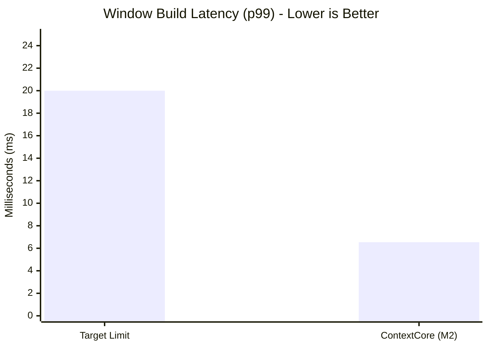
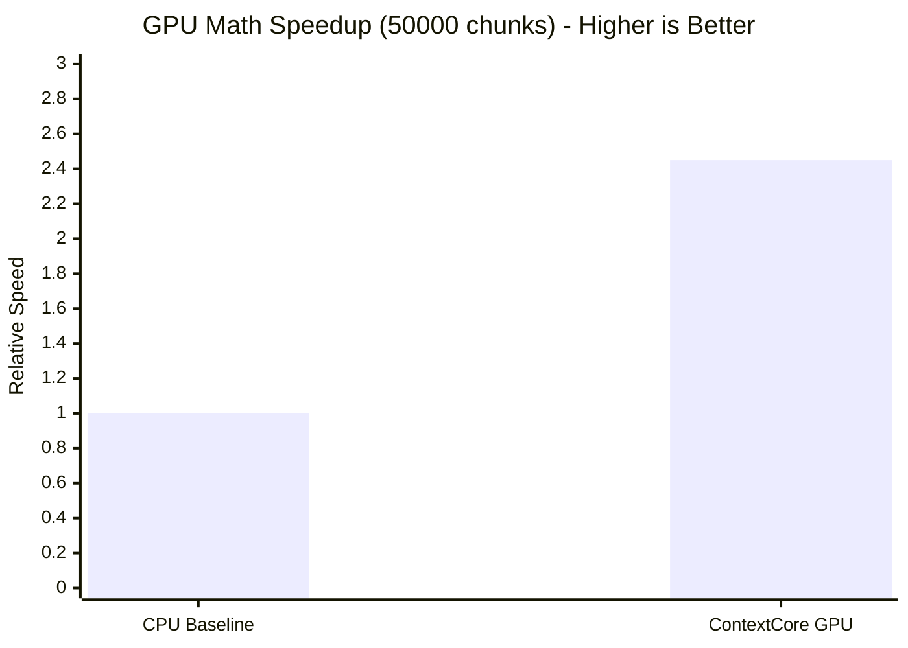

# ContextCore

<div align="center">
  
  <br>
  <h1><b>ContextCore</b></h1>
  <h3><b>GPU-accelerated context memory for on-device AI agents on Apple Silicon.</b></h3>
  
  <p>
    <a href="https://swift.org"></a>
    <a href="https://developer.apple.com/ios/"></a>
    <a href="https://developer.apple.com/macos/"></a>
    <a href="LICENSE"></a>
    <a href="https://discord.gg/NHgNh7HJ6M"></a>
  </p>
</div>

---

## What it does

*   **Metal-accelerated scoring:** custom Metal shaders handle relevance and recency scoring, with measured throughput at **63.36M chunks/sec** and **2.45x GPU math speedup** on large workloads.
*   **Four memory tiers:** working, episodic, semantic, and procedural memory each have their own retrieval role.
*   **Progressive compression:** lower-signal chunks can be compressed automatically when the token budget gets tight.
*   **Fast window builds:** `buildWindow(500, 4096)` measures **4.89ms p99** on the latest full release run.
*   **Background consolidation:** `consolidate(2000)` measures **15.61ms p99**.
*   **Attention-aware reranking:** context chunks can be reordered by attention centrality.

## 🏗️ Architecture


```mermaid
flowchart TB
    subgraph Client ["Your Application"]
        Input([User Input])
    end

    subgraph Core ["ContextCore Engine"]
        direction TB
        Orch[AgentContext]
        
        subgraph Metal ["Metal Acceleration ⚡️"]
            Scoring[Scoring Kernel]
            Attn[Attention Kernel]
        end
        
        subgraph Mem ["Memory Tiers"]
            Episodic[(Episodic)]
            Semantic[(Semantic)]
            Procedural[(Procedural)]
        end
        
        Packer[Window Packer]
    end

    Input --> Orch
    Orch -->|Query| Mem
    Mem -->|Candidates| Scoring
    Scoring -->|Ranked Chunks| Attn
    Attn -->|Reranked| Packer
    Packer -->|Final Prompt| Model([LLM Inference])

    style Core fill:#fff,stroke:#000,stroke-width:2px,color:#000
    style Metal fill:#000,stroke:#fff,stroke-width:1px,color:#fff
    style Scoring fill:#000,stroke:#fff,stroke-width:1px,color:#fff
    style Attn fill:#000,stroke:#fff,stroke-width:1px,color:#fff
    style Client fill:#fff,stroke:#000,stroke-dasharray: 5 5
    style Model fill:#000,color:#fff
```

## Why ContextCore

| Feature | ❌ Standard LLM Usage | ✅ With ContextCore |
| :--- | :--- | :--- |
| **Recall** | Forgets early conversation turns as context fills. | Retrieves relevant turns from earlier in the thread with semantic search. |
| **Speed** | Slows down linearly as context grows. | Window building stays under **5ms p99** and consolidation stays under **16ms p99** on the measured M2 run. |
| **Cost** | Wastes tokens by re-sending irrelevant history. | Packs higher-value tokens first and compresses the rest. |
| **Coherence** | Loses track of long-running tasks. | Procedural memory tracks tool usage and task patterns. |

## 📊 Performance

ContextCore is designed to run locally on Apple Silicon.


```mermaid
xychart-beta
    title "Window Build Latency (p99) - Lower is Better"
    x-axis ["Target Limit", "ContextCore (M2)"]
    y-axis "Milliseconds (ms)" 0 --> 25
    bar [20.0, 6.54]
```


```mermaid
xychart-beta
    title "Consolidation Time (2000 chunks) - Lower is Better"
    x-axis ["Target Limit", "ContextCore (M2)"]
    y-axis "Milliseconds (ms)" 0 --> 500
    bar [500.0, 19.7]
```


```mermaid
xychart-beta
    title "GPU Math Speedup (50000 chunks) - Higher is Better"
    x-axis ["CPU Baseline", "ContextCore GPU"]
    y-axis "Relative Speed" 0 --> 3
    bar [1.0, 2.45]
```

## 🚀 Quick Start

```swift
import ContextCore

// 1. Initialize ContextCore
let context = try AgentContext()

// 2. Start a session
try await context.beginSession(systemPrompt: "You are a senior Swift engineer.")

// 3. Append turns
try await context.append(turn: Turn(role: .user, content: "How do I fix this actor leak?"))

// 4. Build a packed window
let window = try await context.buildWindow(
    currentTask: "Debug actor isolation",
    maxTokens: 4096
)

// 5. Format for your model
let prompt = window.formatted(style: .chatML)
```

## 🛠 Installation

```swift
dependencies: [
    .package(url: "https://github.com/christopherkarani/ContextCore.git", from: "0.1.0")
]
```

## License

ContextCore is available under the MIT license. See [LICENSE](LICENSE) for details.
