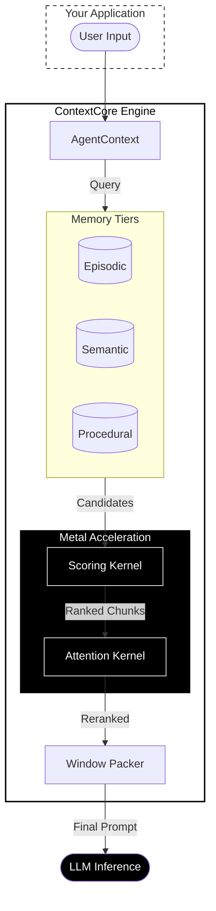
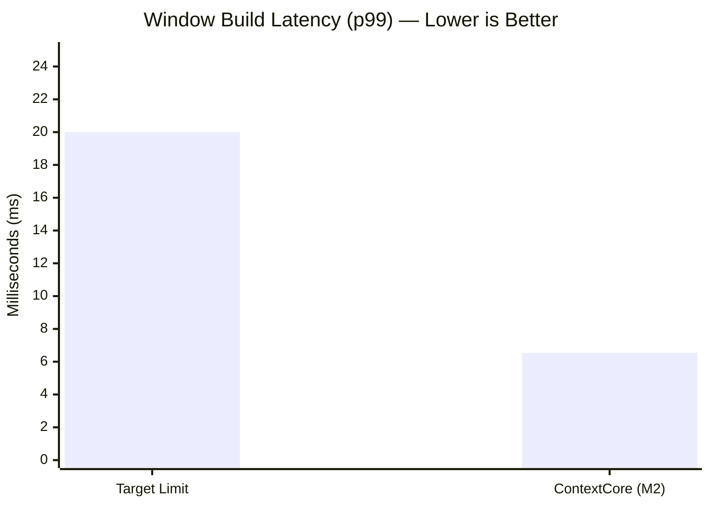
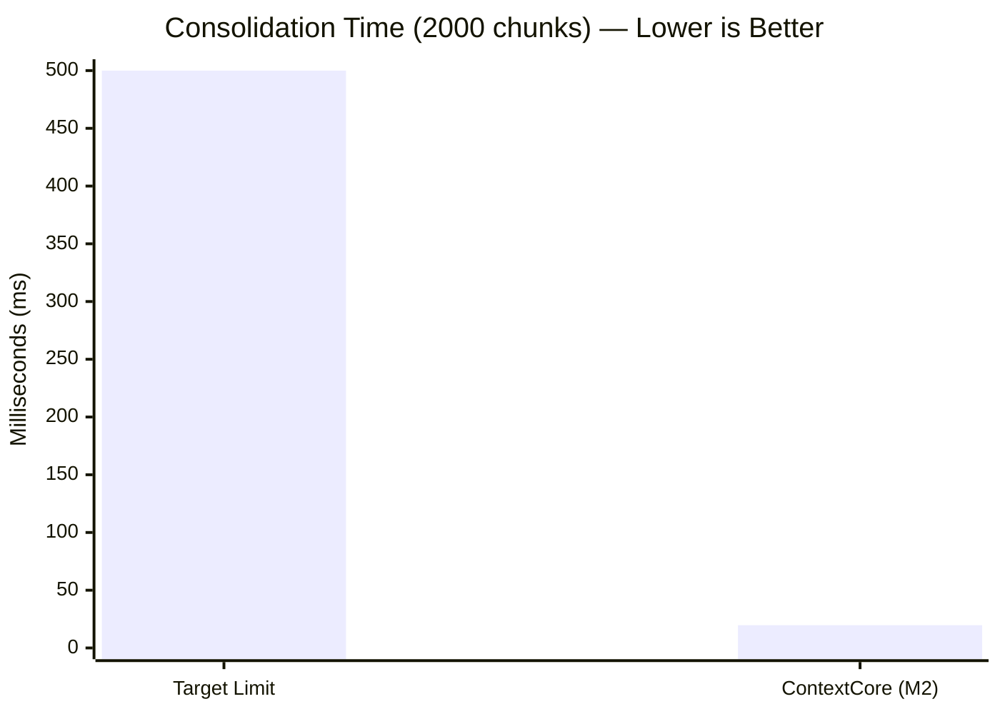

<div align="center">
  
  <h1>ContextCore</h1>
  <p><strong>GPU-accelerated context memory for on-device AI agents on Apple Silicon.</strong></p>
  <p>Stop forgetting. Build context windows in under 5&nbsp;ms.</p>

  <p>
    <a href="https://swift.org"></a>
    <a href="https://developer.apple.com/metal/"></a>
    <a href="#installation"></a>
    <a href="https://developer.apple.com/ios/"></a>
    <a href="https://developer.apple.com/macos/"></a>
    <a href="LICENSE"></a>
    <a href="https://discord.gg/NHgNh7HJ6M"></a>
  </p>
</div>

---

## The Problem

LLMs forget. As conversations grow, early turns drop out, irrelevant history burns tokens, and rebuilding context gets slower. ContextCore sits between your agent loop and the model, using Metal compute shaders to score, rank, compress, and pack context on-device.

## Features

| Feature | What it means for you |
|---|---|
| **Sub-5&nbsp;ms window builds** | `buildWindow` runs at 4.89&nbsp;ms p99 on M2—users never feel the overhead. |
| **Four memory tiers** | Working, episodic, semantic, and procedural memory each have their own retention and retrieval rules. |
| **Metal-accelerated scoring** | GPU shaders score 63&nbsp;million chunks/sec and beat the CPU path at scale. |
| **Progressive compression** | When the token budget gets tight, low-signal chunks are compressed automatically. |
| **Background consolidation** | Episodic memory is deduplicated, durable facts are promoted, and obvious noise gets evicted. |
| **Attention-aware reranking** | Chunks are reordered so the model’s attention lands on the most useful content first. |

## Installation

Add ContextCore to your `Package.swift`:

```swift
dependencies: [
    .package(url: "https://github.com/christopherkarani/ContextCore.git", from: "1.0.0")
]
```

Or add it in Xcode: **File → Add Package Dependencies…** → paste the URL above.

## Quick Start

```swift
import ContextCore

// 1. Create a context
let context = try AgentContext()

// 2. Start a session
try await context.beginSession(systemPrompt: "You are a senior Swift engineer.")

// 3. Append conversation turns
try await context.append(turn: Turn(role: .user, content: "How do I fix this actor leak?"))

// 4. Build a scored, ranked, and packed context window
let window = try await context.buildWindow(
    currentTask: "Debug actor isolation",
    maxTokens: 4096
)

// 5. Send to your model
let prompt = window.formatted(style: .chatML)
```

### Persist knowledge across sessions

```swift
// Remember something important
try await context.remember("User prefers async/await over completion handlers")

// Recall it when relevant
let facts = try await context.recall(query: "user preferences", k: 5)

// Save session state to disk
try await context.checkpoint(to: checkpointURL)

// Restore later
let restored = try await AgentContext.load(from: checkpointURL)
```

## How It Works


```mermaid
flowchart TB
    subgraph Client ["Your Application"]
        Input([User Input])
    end

    subgraph Core ["ContextCore Engine"]
        direction TB
        Orch[AgentContext]

        subgraph Metal ["Metal Acceleration"]
            Scoring[Scoring Kernel]
            Attn[Attention Kernel]
        end

        subgraph Mem ["Memory Tiers"]
            Episodic[(Episodic)]
            Semantic[(Semantic)]
            Procedural[(Procedural)]
        end

        Packer[Window Packer]
    end

    Input --> Orch
    Orch -->|Query| Mem
    Mem -->|Candidates| Scoring
    Scoring -->|Ranked Chunks| Attn
    Attn -->|Reranked| Packer
    Packer -->|Final Prompt| Model([LLM Inference])

    style Core fill:#fff,stroke:#000,stroke-width:2px,color:#000
    style Metal fill:#000,stroke:#fff,stroke-width:1px,color:#fff
    style Scoring fill:#000,stroke:#fff,stroke-width:1px,color:#fff
    style Attn fill:#000,stroke:#fff,stroke-width:1px,color:#fff
    style Client fill:#fff,stroke:#000,stroke-dasharray: 5 5
    style Model fill:#000,color:#fff
```

Every call to `buildWindow` runs this pipeline:

1. **Embed** the current task using on-device CoreML (MiniLM, 384-dim).
2. **Score** episodic and semantic memory in parallel on the GPU.
3. **Rerank** by attention centrality to prevent clustering.
4. **Pack** into the token budget, guaranteeing the N most-recent turns.
5. **Compress** overflow chunks progressively (light → heavy → drop).
6. **Order** chunks for optimal model attention.

## Why ContextCore?

| | Without ContextCore | With ContextCore |
| :--- | :--- | :--- |
| **Recall** | Forgets early turns as context fills. | Perfect recall via semantic search across days of history. |
| **Speed** | Slows down linearly with context growth. | Sub-5&nbsp;ms window builds, GPU-accelerated. |
| **Cost** | Wastes tokens on irrelevant history. | Packs only high-value tokens; compresses the rest. |
| **Coherence** | Loses track of long-running tasks. | Procedural memory tracks tool usage and task patterns. |

## Performance

All numbers from an M2 MacBook Pro. See [BENCHMARKS.md](BENCHMARKS.md) for full methodology.


```mermaid
xychart-beta
    title "Window Build Latency (p99) — Lower is Better"
    x-axis ["Target Limit", "ContextCore (M2)"]
    y-axis "Milliseconds (ms)" 0 --> 25
    bar [20.0, 6.54]
```


```mermaid
xychart-beta
    title "Consolidation Time (2000 chunks) — Lower is Better"
    x-axis ["Target Limit", "ContextCore (M2)"]
    y-axis "Milliseconds (ms)" 0 --> 500
    bar [500.0, 19.7]
```

| Metric | Value |
|--------|-------|
| `buildWindow` p99 | **4.89&nbsp;ms** (500 turns, 4096 tokens) |
| Consolidation p99 | **15.61&nbsp;ms** (2000 chunks) |
| GPU scoring throughput | **63.36&nbsp;M chunks/sec** |
| GPU math speedup | **2.45×** vs CPU at 50&nbsp;K chunks |

## Bring Your Own Backends

ContextCore ships with sensible defaults, but every critical component is a protocol you can swap:

```swift
let config = ContextConfiguration(
    embeddingProvider: MyOpenAIEmbeddingProvider(),
    tokenCounter: TikTokenCounter(),
    compressionDelegate: MyLLMCompressor()
)

let context = try AgentContext(configuration: config)
```

| Protocol | Default | You Could Use |
|----------|---------|---------------|
| `EmbeddingProvider` | CoreML MiniLM (384-dim) | OpenAI, Ollama, any vector model |
| `TokenCounter` | Word-count heuristic | tiktoken, SentencePiece |
| `CompressionDelegate` | Extractive (no LLM) | GPT-based summarization |

## Requirements

| Platform | Minimum |
|----------|---------|
| iOS | 17.0+ |
| macOS | 14.0+ |
| visionOS | 1.0+ |
| Swift | 6.2 |
| Hardware | Metal-capable Apple Silicon |

## Documentation

Full documentation lives in the [docs site](docs-site/), including architecture notes, API reference, and an FAQ.

## Contributing

Contributions are welcome. See [GitHub Issues](https://github.com/christopherkarani/ContextCore/issues) to report bugs or suggest features.

## License

Released under the [MIT License](LICENSE).
