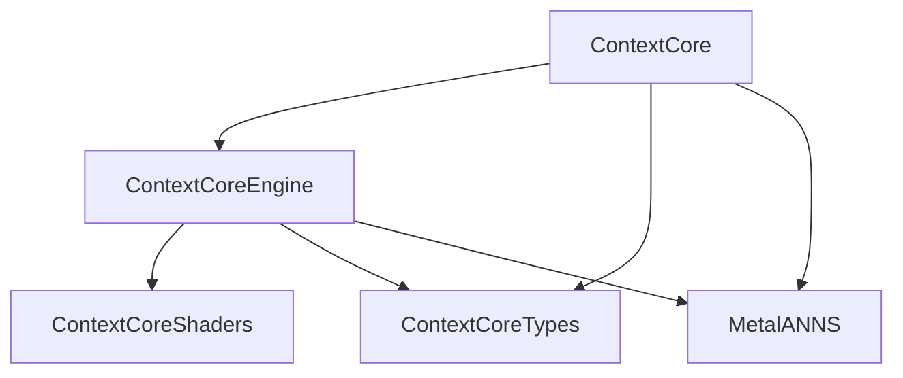
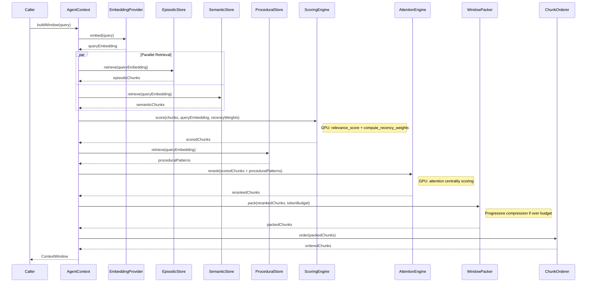

# Architecture Overview

ContextCore is a Swift framework that provides GPU-accelerated context window management for LLM-powered agents. It retrieves, scores, compresses, and packs memory chunks into token-budgeted context windows using Metal compute shaders.

## Module Structure

The framework is organized into four Swift Package Manager targets, layered by responsibility.

### ContextCoreTypes

Pure value types with zero dependencies. This module defines the data model and protocol contracts used by every other layer.

- **Models:** `Turn`, `TurnRole`, `MemoryChunk`, `MemoryType`, `ToolCall`, error types
- **Protocols:** `EmbeddingProvider`, `TokenCounter`, `CompressionDelegate`, `ConsolidationStores`

### ContextCoreShaders

Metal compute shaders bundled as package resources. These are compiled at runtime and dispatched on the GPU.

- `relevance_score` -- cosine similarity between query and chunk embeddings
- `topk_indices` -- parallel top-k selection
- `compute_recency_weights` -- time-decay weighting
- Attention scoring kernels
- Compression scoring kernels

Links the Metal framework.

### ContextCoreEngine

GPU-backed processing engines that operate on types from ContextCoreTypes and dispatch work through ContextCoreShaders.

| Component | Role |
|---|---|
| `ScoringEngine` | GPU relevance + recency scoring of memory chunks |
| `AttentionEngine` | Attention centrality computation and eviction scoring |
| `CompressionEngine` | Sentence-level extractive compression |
| `ConsolidationEngine` | Fact promotion, deduplication, and merge |
| `MetalContext` | Shared Metal device, command queue, and shader library management |
| `EmbeddingCache` | LRU cache for embedding vectors |
| `CPUReference` | CPU fallback implementations for environments without Metal |

### ContextCore

The public API layer. This is the only module consumers import directly.

| Component | Role |
|---|---|
| `AgentContext` (actor) | Main public API for building context windows |
| `ContextConfiguration` | Runtime tuning parameters (budget, thresholds, compression levels) |
| `ContextWindow` / `ContextChunk` | Output types returned to callers |
| `WindowPacker` | Budget-constrained packing of scored chunks |
| `ProgressiveCompressor` | Multi-level compression when budget is tight |
| `ChunkOrderer` | Attention-aware chunk ordering for coherent output |
| `EpisodicStore` | Conversation history and turn-level memory |
| `SemanticStore` | Long-term knowledge and fact memory |
| `ProceduralStore` | Tool usage patterns and behavioral memory |
| `SessionStore` | Session state management and persistence |
| `ContextCheckpoint` | Snapshot and restore of context state |

## Module Dependencies

Dependencies flow strictly downward. `ContextCoreTypes` and `ContextCoreShaders` have no internal dependencies, keeping the foundation stable and independently testable. `MetalANNS` is an external package providing approximate nearest neighbor search on the GPU.

## Data Flow: `buildWindow()`

The `AgentContext.buildWindow()` method orchestrates the full pipeline from task query to packed context window.

### Pipeline Steps

1. **Embed the query.** The task query is converted to a vector via the configured `EmbeddingProvider`. Results are cached in `EmbeddingCache` to avoid redundant work.

2. **Parallel retrieval.** Episodic and semantic stores are queried concurrently using the query embedding. Each store returns its top candidate chunks with pre-computed embeddings.

3. **GPU scoring.** The `ScoringEngine` dispatches Metal compute shaders to calculate relevance scores (cosine similarity) and recency weights (time-decay) for all candidate chunks in a single GPU pass.

4. **Procedural retrieval.** Tool usage patterns and behavioral memory are retrieved from the `ProceduralStore` based on the query context.

5. **Attention reranking.** The `AttentionEngine` computes attention centrality across all scored chunks and procedural patterns, producing a final ranking that accounts for inter-chunk relationships.

6. **Budget-constrained packing.** The `WindowPacker` greedily packs chunks into the token budget. If the budget is exceeded, `ProgressiveCompressor` applies multi-level extractive compression to fit more content.

7. **Chunk ordering.** The `ChunkOrderer` arranges packed chunks in an attention-aware order that maximizes coherence for the downstream LLM.

8. **Return.** The final `ContextWindow` is returned containing ordered chunks, token counts, and metadata about what was included or evicted.
